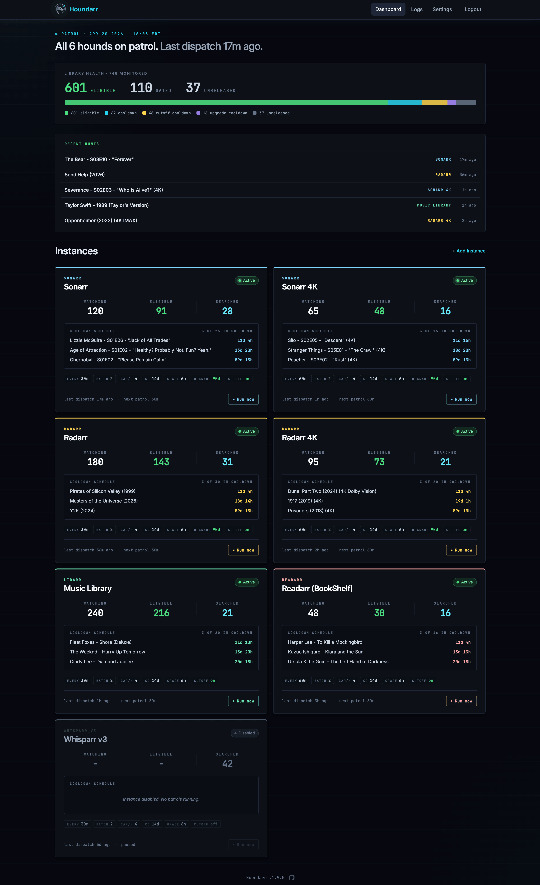
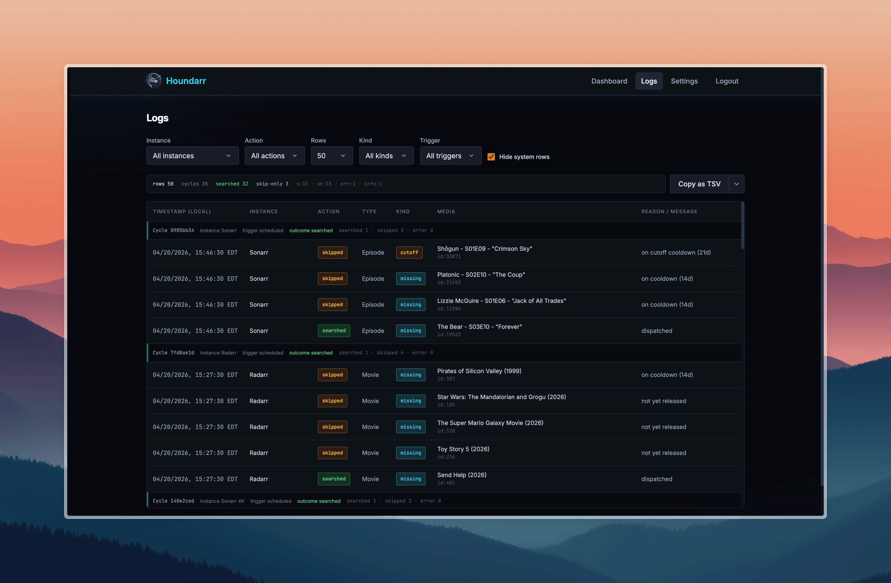

<div align="center">


# Houndarr

**Automated missing-media search for your \*arr stack.**<br>
Small batches. Polite intervals. Zero indexer abuse.

[](https://github.com/av1155/houndarr/stargazers)
[](LICENSE)
[](https://github.com/av1155/houndarr/commits/main)
[](https://github.com/av1155/houndarr/releases/latest)
[](https://github.com/av1155/houndarr/pkgs/container/houndarr)
[](https://github.com/av1155/houndarr/graphs/contributors)
[](https://discord.gg/t29AhAarYk)

[Documentation](https://av1155.github.io/houndarr/)
&ensp;&bull;&ensp;
[Quick Start](https://av1155.github.io/houndarr/docs/guides/installation/docker-compose)
&ensp;&bull;&ensp;
[Docker](https://github.com/av1155/houndarr/pkgs/container/houndarr)
&ensp;&bull;&ensp;
[Helm Chart](https://av1155.github.io/houndarr/docs/guides/installation/helm)
&ensp;&bull;&ensp;
[Discord](https://discord.gg/t29AhAarYk)
&ensp;&bull;&ensp;
[Report Bug](https://github.com/av1155/houndarr/issues/new/choose)

</div>

---

<div align="center">



<br><br>


&nbsp;&nbsp;


</div>

<br>

## What is Houndarr?

Radarr, Sonarr, Lidarr, Readarr, and Whisparr monitor RSS feeds for new releases, but they do not go back and actively search for content already in your library that is missing or below your quality cutoff. Their built-in "Search All Missing" button fires every item at once, which can overwhelm indexer API limits and get you temporarily banned.

Houndarr fixes this by searching slowly, politely, and automatically. It works through your backlog in small, configurable batches with sleep intervals between cycles, per-item cooldowns, and hourly API caps. It runs as a single Docker container alongside your existing \*arr stack and stays out of the way.

## What Houndarr does and doesn't do

**Does.** Trigger searches on your Radarr / Sonarr / Lidarr / Readarr / Whisparr instances for items they already report as missing or below quality cutoff. Read-only REST calls to your configured \*arrs plus `POST /api/v{1,3}/command` for each search. That is the entire network surface.

**Doesn't.** Phone home, report telemetry, ship obfuscated code, manage download clients, integrate Prowlarr, bundle Usenet or torrent clients, scrape indexers directly, or contact any service outside the \*arr instances you configure.

**Polite by default.** Small batches and long intervals out of the box. Configured caps are the ceiling, not the floor, and Houndarr never ignores an indexer's retry-after. Designed so you never have to think about your indexer's daily budget.

See [SECURITY.md](SECURITY.md) for the full security posture.

## Key Features

**Supported Apps**

- Radarr, Sonarr, Lidarr, Readarr, and Whisparr
- Connect multiple instances of each

**Search Modes**

- Missing media (episodes, movies, albums, books)
- Cutoff-unmet items below your quality profile
- Library upgrades for items that already meet cutoff
- Configurable search context (episode vs. season, album vs. artist, book vs. author)

**Rate Limiting and Safety**

- Small, configurable batch sizes with sleep intervals between cycles
- Per-item cooldown prevents re-searching the same item too soon
- Per-instance hourly API cap keeps indexer usage in check
- Download-queue backpressure gate skips cycles when the queue is full
- Bounded multi-page scanning so deep backlog items are not starved
- Optional per-instance time windows so scheduled searches only run during configured hours
- Per-instance search order: random (default) spreads picks across the whole backlog each cycle, chronological walks oldest-first

**Web UI**

- Live dashboard with instance status cards and run-now buttons
- Filterable, searchable log viewer with multi-format copy and export
- Dark-themed interface (FastAPI + HTMX + Tailwind CSS)

## Quick Start

Create a `docker-compose.yml`:

```yaml
services:
  houndarr:
    image: ghcr.io/av1155/houndarr:latest
    container_name: houndarr
    restart: unless-stopped
    ports:
      - "8877:8877"
    volumes:
      - ./data:/data
    environment:
      - TZ=America/New_York
      - PUID=1000
      - PGID=1000
```

```bash
docker compose up -d
```

Open `http://<your-host>:8877` and create your admin account on the setup screen.

<details>
<summary>Prefer <code>docker run</code>?</summary>

<br>

```bash
docker run -d \
  --name houndarr \
  --restart unless-stopped \
  -p 8877:8877 \
  -v /path/to/data:/data \
  -e TZ=America/New_York \
  -e PUID=1000 \
  -e PGID=1000 \
  ghcr.io/av1155/houndarr:latest
```

Replace `/path/to/data` with an absolute path on your host where Houndarr should store its database and master key.

</details>

For environment variables, reverse proxy setup, Kubernetes, Helm, and building from source, see the [full documentation](https://av1155.github.io/houndarr/docs/guides/installation/docker).

<details>
<summary><strong>What Houndarr Does NOT Do</strong></summary>

<br>

- **No download-client integration**: it triggers searches in your \*arr instances, which handle downloads
- **No Prowlarr/indexer management**: your \*arr instances manage their own indexers
- **No request workflows**: no Overseerr/Ombi-style request handling
- **No multi-user support**: single admin username and password
- **No media file manipulation**: it never touches your library files

</details>

## Security and Trust

- No telemetry, analytics, or call-home. The only outbound connections go to your configured \*arr instances.
- API keys are encrypted at rest with Fernet (AES-128-CBC + HMAC-SHA256) and never sent back to the browser.
- Authentication uses bcrypt password hashing, signed session tokens, CSRF protection, and login rate limiting.
- The container runs as a non-root user after PUID/PGID remapping.
- 63 integration tests validate immunity to every finding from the Huntarr.io security review; a live smoke test runs in CI on every PR.

For details on how Houndarr handles credentials, network behavior, and trust boundaries, see [Security Overview](https://av1155.github.io/houndarr/docs/security/overview). To report a vulnerability, see [SECURITY.md](SECURITY.md).

## Contributing and Community

For questions, troubleshooting, or casual discussion, join the [Houndarr Discord](https://discord.gg/t29AhAarYk). For bug reports and feature requests, open a [GitHub issue](https://github.com/av1155/houndarr/issues/new/choose).

See [CONTRIBUTING.md](CONTRIBUTING.md) for development workflow, coding standards, and quality gates.

<div align="center">

<a href="https://star-history.com/#av1155/houndarr&Date">
  
</a>

<br><br>

<a href="https://github.com/av1155/houndarr/graphs/contributors">
  
</a>

<br><br>

If Houndarr is useful to you, consider giving it a <a href="https://github.com/av1155/houndarr/stargazers">star on GitHub</a>.

</div>

## License

[GNU AGPLv3](LICENSE)
