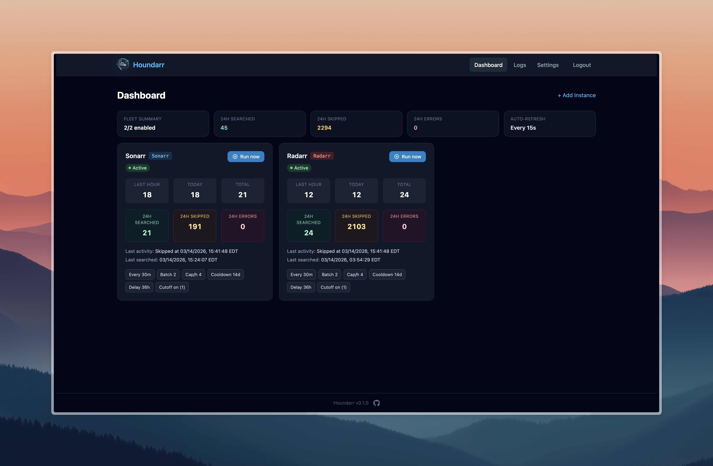
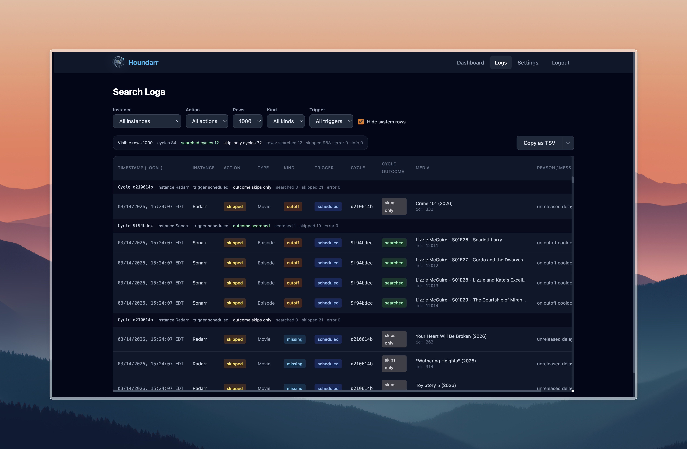
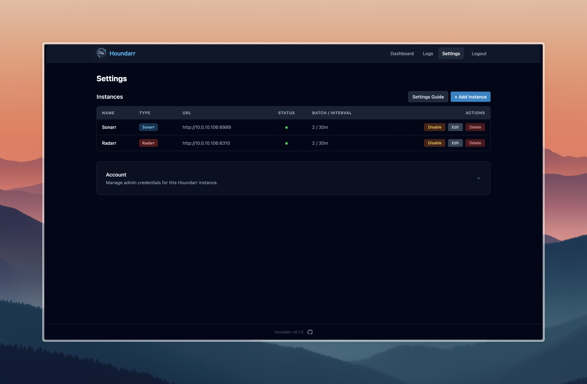

# Houndarr

<p align="center">
  
</p>

> A focused, self-hosted companion for Sonarr and Radarr that automatically searches for missing media in polite, controlled batches.
>
> **[Documentation](https://av1155.github.io/houndarr/)** | **[Quick Start](https://av1155.github.io/houndarr/docs/getting-started/quick-start)**

---

## What Houndarr Does

Sonarr and Radarr monitor RSS feeds for new releases, but they do not go back
and actively search for content already in your library that is missing or
below your quality cutoff. Their built-in "Search All Missing" button fires
every item at once, overwhelming indexer API limits.

Houndarr searches **slowly, politely, and automatically**: small batches,
configurable sleep intervals, per-item cooldowns, hourly API caps, and quiet
hours. It runs as a single Docker container alongside your existing *arr stack.

**Key capabilities:**

- Connects to one or more Sonarr and Radarr instances
- Searches for **missing** episodes and movies in small, configurable batches
- Searches for **cutoff-unmet** items (below your quality profile) separately
- Sonarr: episode-level search by default, with optional season-context mode
- Radarr: movie-level search
- Per-item cooldown prevents re-searching the same item too soon
- Per-instance hourly API cap keeps indexer usage in check
- Bounded multi-page scanning so deep backlog items are not starved
- Live dashboard with instance status cards and run-now buttons
- Filterable, searchable log viewer with multi-format copy/export
- Dark-themed web UI (FastAPI + HTMX + Tailwind CSS)

## What Houndarr Does Not Do

- **No download-client integration** — it triggers searches in Sonarr/Radarr, which handle downloads
- **No Prowlarr/indexer management** — your *arr instances manage their own indexers
- **No request workflows** — no Overseerr/Ombi-style request handling
- **No multi-user support** — single admin username and password
- **No media file manipulation** — it never touches your library files

---

## Screenshots

| Dashboard | Logs | Settings |
|:---------:|:----:|:--------:|
|  |  |  |

---

## Quick Start (Docker Compose)

Create a `docker-compose.yml`:

```yaml
services:
  houndarr:
    image: ghcr.io/av1155/houndarr:latest
    container_name: houndarr
    restart: unless-stopped
    ports:
      - "8877:8877"
    volumes:
      - ./data:/data
    environment:
      - TZ=America/New_York
      - PUID=1000
      - PGID=1000
```

Then run:

```bash
docker compose up -d
```

Open `http://<your-host>:8877` in your browser. On first launch you will be
prompted to create an admin username and password.

<details>
<summary>Prefer <code>docker run</code>?</summary>

```bash
docker run -d \
  --name houndarr \
  --restart unless-stopped \
  -p 8877:8877 \
  -v /path/to/data:/data \
  -e TZ=America/New_York \
  -e PUID=1000 \
  -e PGID=1000 \
  ghcr.io/av1155/houndarr:latest
```

Replace `/path/to/data` with an absolute path on your host where Houndarr
should store its database and master key.

</details>

## Environment Variables

| Variable | Default | Description |
|----------|---------|-------------|
| `HOUNDARR_DATA_DIR` | `/data` | Directory for persistent data (SQLite DB and master key) |
| `HOUNDARR_HOST` | `0.0.0.0` | Host address to bind the web server to |
| `HOUNDARR_PORT` | `8877` | Port to bind the web server to |
| `HOUNDARR_DEV` | `false` | Enable development mode (auto-reload, API docs) |
| `HOUNDARR_LOG_LEVEL` | `info` | Log level: `debug`, `info`, `warning`, `error` |
| `HOUNDARR_SECURE_COOKIES` | `false` | Set `Secure` flag on cookies (enable when behind HTTPS) |
| `HOUNDARR_TRUSTED_PROXIES` | _(empty)_ | Comma-separated trusted reverse-proxy IPs for `X-Forwarded-For` |
| `PUID` | `1000` | User ID for file ownership inside the container |
| `PGID` | `1000` | Group ID for file ownership inside the container |
| `TZ` | `UTC` | Container timezone (e.g. `America/New_York`) |

> **Note — LXC / Proxmox / root-based hosts:** If your Docker host runs containers
> as root (a common setup in Proxmox LXC containers), set `PUID=0` and `PGID=0`.
> Houndarr will skip the privilege-drop and run directly as root, matching the
> security posture of the rest of your stack. A warning will be printed to stdout
> at startup as a reminder.

## Reverse Proxy

If you run Houndarr behind a reverse proxy (Nginx, Caddy, Traefik, etc.):

1. Set `HOUNDARR_SECURE_COOKIES=true` so session cookies require HTTPS.
2. Set `HOUNDARR_TRUSTED_PROXIES` to your proxy's IP address (e.g. `172.18.0.1`)
   so the login rate limiter sees real client IPs via `X-Forwarded-For`.
3. Proxy all traffic to `http://houndarr:8877`.

## First-Run Setup

1. Navigate to `http://<your-host>:8877`.
2. Create an admin username and password on the setup screen.
3. Log in with your new credentials.
4. Go to **Settings** and add your Sonarr/Radarr instances (URL + API key).
5. Enable each instance — Houndarr will begin searching on the configured schedule.

For detailed per-instance configuration options, see the
[Instance Settings Guide](docs/settings.md).

---

## Building from Source

```bash
# Clone and set up
git clone https://github.com/av1155/houndarr.git
cd houndarr
python3 -m venv .venv
.venv/bin/pip install --upgrade pip
.venv/bin/pip install -r requirements-dev.txt
.venv/bin/pip install -e .

# Run locally in dev mode
.venv/bin/python -m houndarr --data-dir ./data-dev --dev
```

The dev server will be available at `http://localhost:8877`.

---

## Contributing

See [CONTRIBUTING.md](CONTRIBUTING.md) for development workflow, coding
standards, and quality gates.

## Security & Trust

Houndarr is designed for self-hosters who care about what runs on their
network:

- **No telemetry, no call-home.** The only outbound connections are to your
  configured Sonarr/Radarr instances. There are no analytics, update checks, or
  crash reporting.
- **API keys are encrypted at rest** using Fernet symmetric encryption
  (AES-128-CBC + HMAC-SHA256) and are never sent back to the browser.
- **Authentication** uses bcrypt password hashing, signed session tokens, CSRF
  protection, and login rate limiting.
- **The container runs as a non-root user** after PUID/PGID remapping.

For a detailed, code-grounded explanation of how Houndarr handles credentials,
network behavior, and trust boundaries, see
[Trust & Security](docs/trust-and-security.md).

To report a vulnerability, see [SECURITY.md](SECURITY.md).

## License

MIT — see [LICENSE](LICENSE).
