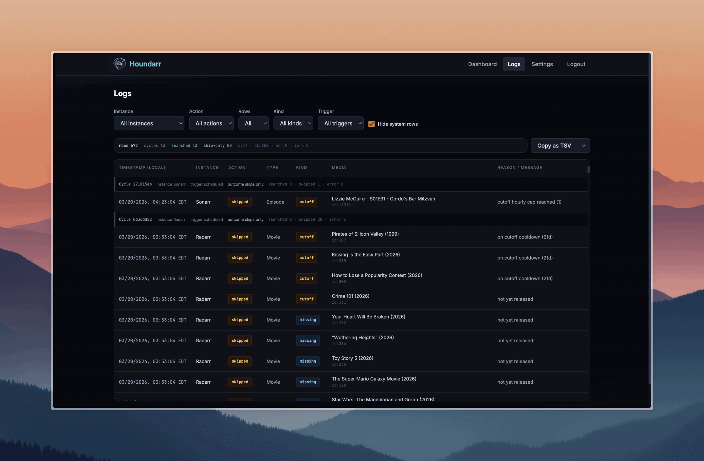
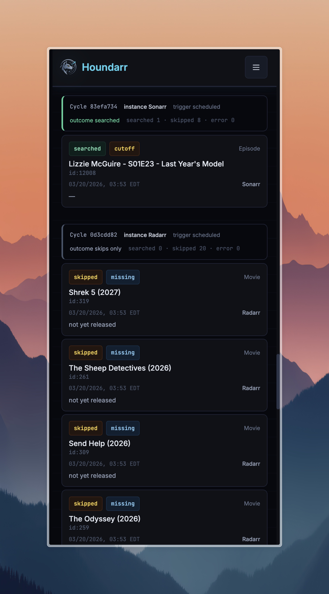

# How Houndarr Works

Houndarr is a search scheduler for Radarr, Sonarr, Lidarr, Readarr, and Whisparr (v2 and v3). It triggers search commands in small, rate-limited batches so you don't have to hit "Search All Missing" and overwhelm your indexers.

It does not download anything, parse releases, or evaluate
quality. Your *arr instances do all the actual searching and
result evaluation. Houndarr only decides **when** to ask them to
search and **how many** items per batch.

## The search cycle

```
1. Houndarr asks your *arr instance: "What items are missing or cutoff-unmet?"
   (and optionally: "What items already meet cutoff but could be upgraded?")
       ↓
2. The instance responds with its wanted list
   (only monitored items that are missing, below quality cutoff, or upgrade-eligible)
       ↓
3. Houndarr applies its scheduling rules to each candidate
   (cooldown, hourly cap, post-release grace, batch size)
       ↓
4. Eligible items → search command sent to the instance
       ↓
5. Ineligible items → logged as "skipped", retried next cycle
```

Your *arr instances do all the actual searching. Houndarr controls the pacing.

## Monitored vs. wanted

A **monitored** item in your *arr instance just means the software is tracking it. If the item is already downloaded at a quality that meets your cutoff, it won't appear in any wanted list, and Houndarr will never touch it.

| Item state | Will Houndarr search it? |
|-----------------------------|--------------------------|
| Monitored + missing | Yes, if eligible under scheduling rules |
| Monitored + downloaded + cutoff met | **No** (unless upgrade search is enabled for the instance) |
| Monitored + downloaded + cutoff unmet | Yes (if cutoff search is enabled), if eligible |
| Not monitored | **No**. Houndarr only reads monitored wanted lists. |

## Who decides "cutoff unmet"?

Your *arr instance, not Houndarr. It populates the `wanted/cutoff` API list based on your quality profile settings. Houndarr reads that list and applies its scheduling rules on top.

If cutoff searches aren't happening, check whether the item actually appears in your instance's own "Wanted > Cutoff Unmet" view first.

:::tip Quality profiles are managed in your *arr instance, not Houndarr
Houndarr works best when your *arr instances are already configured with
quality profiles you trust. It does not manage quality profiles or custom formats.

If you want to build, test, and deploy quality profiles and custom formats across your stack, [Profilarr](https://github.com/Dictionarry-Hub/profilarr) is a community tool built for that. It connects to curated databases like TRaSH Guides, lets you test custom format conditions before deploying, and pushes configurations to any number of instances. It is optional and fully independent of Houndarr.
:::

## Why only a few items get searched each cycle

Think of it as a funnel:

```
Your monitored library
        │
        │  *arr instance filter: missing, cutoff-unmet, or upgrade-eligible items
        ▼
  Wanted list (much smaller)
        │
        │  Houndarr filter: cooldown, post-release grace, hourly cap
        ▼
  Eligible this cycle (smaller still)
        │
        │  Batch size limit
        ▼
  Actually searched (often just 1–3 items)
```

For example, if you have 500 monitored movies in Radarr but only 50 are cutoff-unmet, and 35 of those are on cooldown, 8 are still in their post-release grace window, and your batch is 1, Houndarr searches 1 movie that cycle. The rest wait for cooldowns to expire or grace windows to pass, and Houndarr works through them over days and weeks. Missing items that were blocked only by release timing can get one early retry once they become eligible.

## The three search passes

Each enabled instance can run up to three independent passes:

| Pass | What it searches | Key controls |
|------|-----------------|--------------|
| **Missing** | Items from the instance's `wanted/missing` list | Batch size, sleep interval, hourly cap, cooldown, post-release grace |
| **Cutoff** | Items from the instance's `wanted/cutoff` list | Cutoff batch, cutoff cap, cutoff cooldown |
| **Upgrade** | Library items that already have files and meet cutoff | Upgrade batch (hard cap: 5), upgrade cap (hard cap: 5), upgrade cooldown (min 7 days) |

Cutoff search is **off by default**. Enable it only after missing items are under control so the two passes don't compete for the same indexer budget.

Upgrade search is also **off by default** and much more conservative. It re-searches items that your *arr instance already considers complete, letting the instance find better releases based on quality profiles and custom format scoring. Enable it only after both missing and cutoff backlogs are stable.

If a missing item was skipped because it was `not yet released` or still inside
`post-release grace (Nh)`, Houndarr allows one retry as soon as that release-timing
gate clears instead of waiting for the full missing cooldown. Cutoff keeps its
normal cooldown behavior.

## What "skipped" means in the logs

Every item Houndarr considers but does not search gets an
`action=skipped` log row with a reason string. The canonical list of
reasons and their meanings lives in
[Skip Reasons](/docs/reference/skip-reasons).

A high skip count with zero errors is pacing working as designed: the
engine examines candidates, finds most ineligible under your rules,
and waits for the next cycle.



On mobile, log entries are presented as stacked cards; each card corresponds to one cycle group or individual row:



See [FAQ](/docs/faq) for answers to specific questions, and [Verify It's Working](/docs/guides/verify-its-working) to confirm everything is connected and running.
