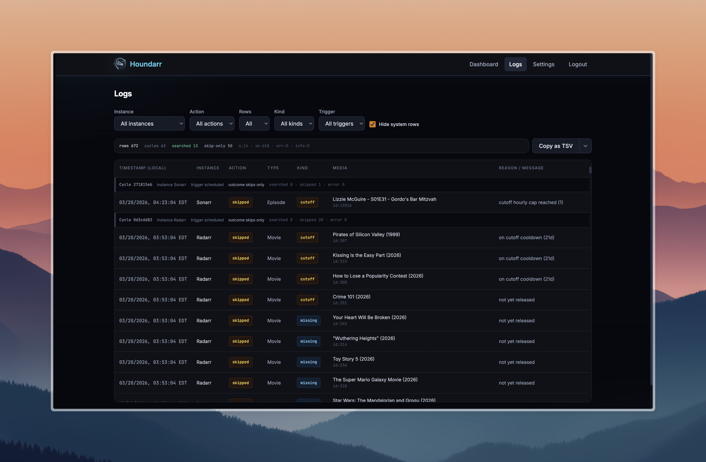

# Troubleshooting

## How to verify Houndarr is working

If you are unsure whether Houndarr is actually doing anything, follow these steps before assuming something is broken.

### Step 1: Open your *arr instance's own wanted pages

In Sonarr/Whisparr: **Wanted → Missing** and **Wanted → Cutoff Unmet**  
In Radarr: **Wanted → Missing** and **Wanted → Cutoff Unmet**  
In Lidarr: **Wanted → Missing** and **Wanted → Cutoff Unmet**  
In Readarr: **Wanted → Missing** and **Wanted → Cutoff Unmet**

If those pages are empty, Houndarr has nothing to search.

### Step 2: Compare items to Houndarr logs

Open Houndarr's **Logs** page and look at recent activity. Each row shows:

| Field | What it tells you |
|-------|-------------------|
| **Action** | `searched` (a search command was sent), `skipped` (item was ineligible this cycle), or `error` (something went wrong) |
| **Reason** | Why the item was skipped or what kind of search was triggered |
| **Item label** | The series/movie/album/book title and relevant details |
| **Timestamp** | When the action occurred |

If you see `searched` entries for items that also appear in your *arr instance's wanted views, Houndarr is working correctly.

#### Log context fields

Each log row includes context fields that help you group and filter activity:

- **`cycle_id`**: a unique ID shared by all rows from a single search cycle (both missing and cutoff passes). Use this to see everything that happened in one run.
- **`cycle_trigger`**: one of `scheduled` (normal timer), `run_now` (manual button press), or `system` (supervisor lifecycle events like startup).
- **`search_kind`**: `missing`, `cutoff`, or `upgrade` for item-level rows; empty for system rows.

The Logs page groups rows by cycle when metadata exists and shows a **Cycle outcome** indicator: `searched` (at least one item was searched), `skips only` (all candidates were ineligible), or `unknown` (no metadata). Use the **Kind** filter to narrow to `missing`, `cutoff`, or `upgrade` rows.

By default, system rows (supervisor startup messages) are hidden. Use the filter controls to show them if needed.

### Step 3: Check "Last Searched" timestamps in your *arr instance

In your instance's cutoff-unmet view, each item shows when it was last searched. If those timestamps match recent Houndarr log entries, you have confirmed end-to-end that the search commands are reaching the instance and being executed.

### Step 4: Expect skips for cooldown, grace, and queue items

If most of your log entries say `skipped`, check the reasons:

- **`on cooldown (Nd)`**: the item was searched recently; Houndarr is waiting before trying again. This is intentional.
- **`on cutoff cooldown (Nd)`**: a cutoff item was searched recently; cutoff keeps its own separate cooldown.
- **`on upgrade cooldown (Nd)`**: an upgrade item was searched recently; upgrade keeps its own separate cooldown.
- **`not yet released`**: the item has no release date or the release date is in the future.
- **`post-release grace (Nh)`**: the release date has passed but the grace window hasn't elapsed yet. Houndarr will search once it clears.
- **`hourly cap reached (N)`**: your missing-pass hourly search limit of `N` has been hit for this cycle.
- **`cutoff hourly cap reached (N)`**: your cutoff hourly search limit of `N` has been hit for this cycle.
- **`upgrade hourly cap reached (N)`**: your upgrade hourly search limit of `N` has been hit for this cycle.
- **`queue backpressure (N/M)`**: the download queue has N items, at or above your configured limit of M. The entire cycle was skipped.

These are all normal scheduling behavior.

For missing items only, a prior `not yet released` or `post-release grace (Nh)`
skip can be followed by one immediate retry on a later cycle once the item
becomes eligible, even if the normal missing cooldown has not fully elapsed.

### Step 5: Check the error count

Look at your logs. If you see many `skipped` entries, some `searched` entries, and zero `error` entries, Houndarr is connected and running correctly. Errors mean something is wrong with the connection or API key; skips do not.

### Step 6: Conservative defaults are slow by design

The default settings are intentionally conservative:

- **Batch size 2**: only 2 items per cycle
- **Hourly cap 4**: maximum 4 searches per hour
- **Cooldown 14 days**: no item is searched more than once every two weeks

With these defaults, Houndarr might search 4–8 items in a day. If your backlog has hundreds of items, clearing it takes weeks. You can increase throughput by raising the batch size or hourly cap, but do so gradually and monitor your indexer health.

See [Instance Settings](/docs/configuration/instance-settings#increasing-throughput) for the recommended order of adjustments.

---

## Common issues

### Houndarr is not connecting to your *arr instance

**Symptoms:** `error` entries in logs with connection refused or timeout messages.

**Checks:**
1. Verify the instance URL is reachable from the Houndarr container. Try `curl <url>/api/v3/system/status?apikey=<key>` from inside the container (use `/api/v1/` for Lidarr and Readarr instead of `/api/v3/`).
2. Confirm the API key is correct in Houndarr's Settings page.
3. If your *arr instance is in the same Docker Compose stack, use the container service name as the hostname (e.g., `http://sonarr:8989`, `http://radarr_hd:7878`), not `localhost`. Container names with underscores are supported.
4. Check that the URL does not have a trailing slash.

### An instance is enabled but nothing is happening

**Checks:**
1. Open your *arr instance's wanted pages. If they are empty, there is nothing for Houndarr to search.
2. Check the Houndarr Logs page for the instance. Look at the most recent entries; if you see `skipped` with reason `hourly cap reached`, wait until the next hour window.
3. Confirm the instance is enabled (green toggle in Settings).
4. Check that the sleep interval has elapsed since the last cycle. With a 30-minute sleep, Houndarr runs approximately twice per hour.

### Cutoff search is not running

**Checks:**
1. Confirm **Cutoff search** is enabled for the instance (it is off by default).
2. Open your *arr instance's "Wanted → Cutoff Unmet" view. If it is empty, there is nothing to search.
3. Check your quality profiles in your *arr instance. An item only appears in the cutoff-unmet list if the file you have does not meet the profile's cutoff quality.
4. Note that cutoff search uses a separate hourly cap (default: 1 per hour). With a cap of 1, you may only see one cutoff search per hour.

### I see errors in the logs

`error` log entries include a message field explaining what went wrong. Common causes:

- **HTTP 401**: API key is wrong or has been rotated in your *arr instance.
- **HTTP 404**: The item was removed from the instance between the time Houndarr read the wanted list and the time it issued the search.
- **Connection refused / timeout**: the instance is unreachable (see connection troubleshooting above).

Occasional 404 errors are harmless. A stream of connection errors suggests a network or configuration issue.

### The Dashboard shows "Next run" but nothing happens

The "Next run" time is an estimate based on the sleep interval. If the container was recently restarted, the first cycle will run after one full sleep interval. Check the Logs page to confirm whether a cycle has completed.
