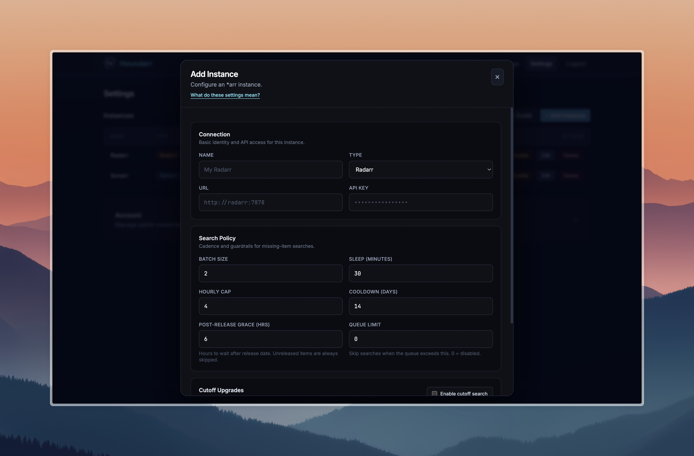
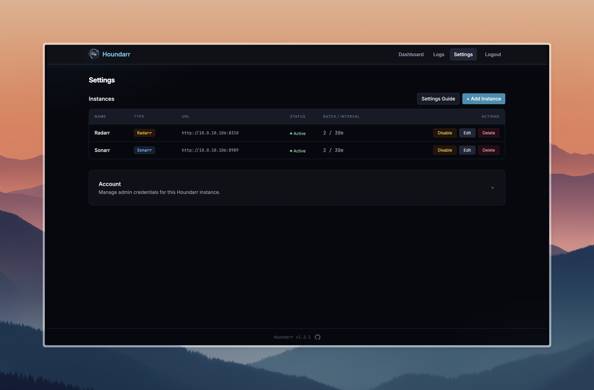

# Instance Settings

This guide explains each setting available when adding or editing an instance
in Houndarr. The defaults are conservative — keep settings low to reduce
indexer/API pressure and avoid bans.

## Search command contract

- **Radarr:** Sends movie-level commands (`MoviesSearch` with `movieIds`).
- **Sonarr (default):** Sends episode-level commands (`EpisodeSearch` with `episodeIds`).
- **Sonarr (advanced):** Missing pass can use season-context commands
  (`SeasonSearch` with `seriesId` + `seasonNumber`) when enabled per instance.
- **Lidarr (default):** Sends album-level commands (`AlbumSearch` with `albumIds`).
- **Lidarr (advanced):** Missing pass can use artist-context commands
  (`ArtistSearch` with `artistId`) when enabled per instance.
- **Readarr (default):** Sends book-level commands (`BookSearch` with `bookIds`).
- **Readarr (advanced):** Missing pass can use author-context commands
  (`AuthorSearch` with `authorId`) when enabled per instance.
- **Whisparr (default):** Sends episode-level commands (`EpisodeSearch` with `episodeIds`).
- **Whisparr (advanced):** Missing pass can use season-context commands
  (`SeasonSearch` with `seriesId` + `seasonNumber`) when enabled per instance.
- Wanted-list reads are restricted to monitored items (`monitored=true`) for both
  missing and cutoff passes across all app types.

## Missing search controls

### Batch Size

Maximum number of missing items considered per cycle.

- **Default:** `2`
- Lower values are safer; higher values clear backlog faster.

### Sleep (minutes)

Wait time between cycles for each enabled instance.

- **Default:** `30`
- Lower values increase request frequency.

### Hourly Cap

Maximum successful missing searches per hour.

- **Default:** `4`
- Set `0` to disable this cap (not recommended unless you trust upstream limits).

### Cooldown (days)

Minimum days before retrying the same missing item.

- **Default:** `14`
- Larger values reduce repeat search noise.
- Missing only: if the latest missing-pass skip for an item was `not yet released`
  or `post-release grace (Nh)`, Houndarr allows one retry as soon as the item
  becomes eligible, even if the normal missing cooldown has not fully elapsed.
- After that retry, normal missing cooldown resumes.

### Post-Release Grace (hours)

Hours to wait after an item's release date before searching.

- **Default:** `6`
- Items still within this window are logged as `post-release grace (Nh)` and skipped.
- Items that have not been released yet (no release date, or date in the future) are always skipped with reason `not yet released`, regardless of this setting.
- Once a missing item clears `not yet released` or `post-release grace (Nh)`,
  Houndarr may retry it on the next missing pass without waiting for the full
  missing cooldown.

Release date evaluation varies by app type:

- **Radarr:** Fallback anchors in order: `digitalRelease` → `physicalRelease` → `releaseDate` → `inCinemas`. Unavailable or pre-release titles may also be skipped using availability signals (`isAvailable` / `status`).
- **Sonarr / Whisparr:** Uses `airDateUtc` (Sonarr) or the `DateOnly` year/month/day object (Whisparr).
- **Lidarr:** Uses the album `releaseDate` field.
- **Readarr:** Uses the book `releaseDate` field.

### Sonarr Missing Search Mode

Strategy for Sonarr missing-pass commands.

- **Default:** `Episode search (default)`
- **Advanced:** `Season-context search (advanced)`

Season-context mode sends at most one `SeasonSearch` per `(series, season)` per pass.

:::info
Cooldown in season-context mode is tracked at the season level using a stable synthetic
identifier derived from the series ID and season number — not through any individual
episode. This ensures cooldown history is consistent across cycles regardless of which
episode happens to appear first on the wanted list.
:::

### Lidarr Missing Search Mode

Strategy for Lidarr missing-pass commands.

- **Default:** `Album search (default)`
- **Advanced:** `Artist-context search (advanced)`

Artist-context mode sends at most one `ArtistSearch` per artist per pass.

### Readarr Missing Search Mode

Strategy for Readarr missing-pass commands.

- **Default:** `Book search (default)`
- **Advanced:** `Author-context search (advanced)`

Author-context mode sends at most one `AuthorSearch` per author per pass.

### Whisparr Missing Search Mode

Strategy for Whisparr missing-pass commands.

- **Default:** `Episode search (default)`
- **Advanced:** `Season-context search (advanced)`

Season-context mode sends at most one `SeasonSearch` per `(series, season)` per pass, same as Sonarr's season-context mode.

## Cutoff upgrade controls

### Cutoff search

Enable searching for items that do not meet your quality cutoff.

- **Default:** Off
- Keep this off unless missing items are already under control.

### Cutoff Batch

Maximum cutoff items considered per cutoff cycle.

- **Default:** `1`

### Cutoff Cooldown

Minimum days before retrying the same cutoff item.

- **Default:** `21`

### Cutoff Cap

Maximum successful cutoff searches per hour.

- **Default:** `1`
- Set `0` to disable cutoff hourly cap.

Cutoff searches use separate cap/cooldown settings from missing searches so they
do not consume the same budget.

The release-aware retry above does not apply to cutoff searches.

## Queue backpressure

When `Queue Limit` is set above zero, Houndarr checks the instance's download
queue before each cycle. If the total queue count meets or exceeds the limit,
the entire cycle is skipped and logged as `queue backpressure (N/M)`.

- **Default:** `0` (disabled)
- If the queue endpoint is unreachable, the search proceeds normally (fails open).
- This prevents Houndarr from piling up work when the download client is already busy.

## Fair backlog scanning

Houndarr does not stop at the first wanted page. During each cycle, it can scan
deeper pages when top candidates are repeatedly ineligible (cooldown, post-release
grace, or caps), but it stays bounded:

- Per-pass list paging has a hard cap (no unbounded page walks)
- Per-pass candidate evaluation has a hard scan budget
- Missing remains primary; cutoff remains separate and conservative

This improves backlog rotation while preserving polite API behavior.

:::tip Why am I seeing mostly skips?
Skips are normal — see [How Houndarr Works](/docs/concepts/how-houndarr-works#what-skipped-means-in-the-logs) and the [FAQ](/docs/concepts/faq) for details.
:::

## Recommended starting profile

| Setting | Value |
|---------|-------|
| Batch Size | `2` |
| Sleep (minutes) | `30` |
| Hourly Cap | `4` |
| Cooldown (days) | `14` |
| Post-Release Grace (hrs) | `6` |
| Queue Limit | `0` (disabled) |
| Cutoff search | Off |
| Cutoff Batch | `1` |
| Cutoff Cooldown | `21` |
| Cutoff Cap | `1` |

## Increasing throughput

Increase one control at a time and observe logs for a full day.

Suggested order:

1. Increase **Batch Size** slightly.
2. Lower **Sleep (minutes)** slightly.
3. Increase **Hourly Cap** only if indexers remain healthy.
4. Enable **Cutoff search** last.

## Status control

Instance enabled/disabled state is controlled from the row toggle in Settings.
New instances are created as enabled by default.

