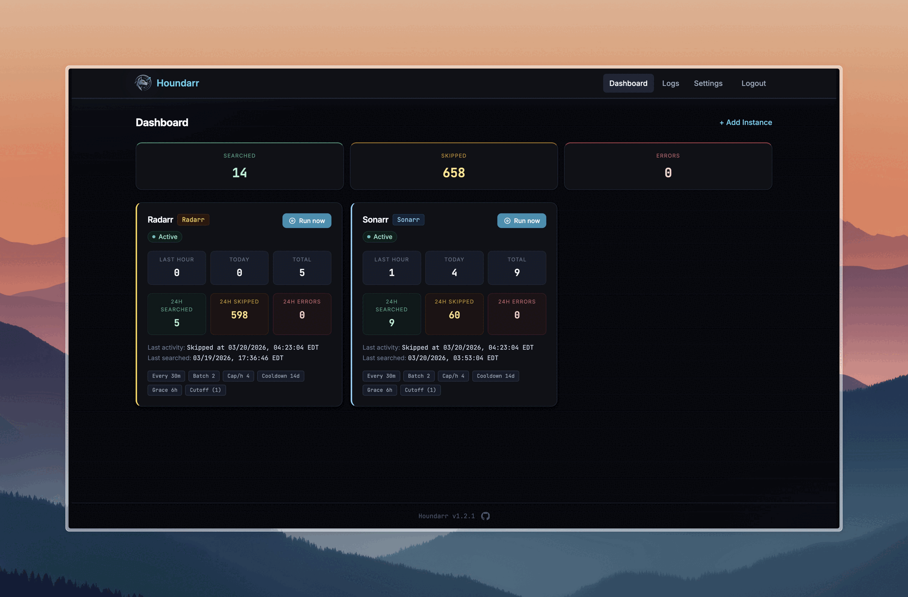

# First-Run Setup

After starting Houndarr for the first time, follow these steps to get it configured.

## 1. Create an admin account

Navigate to `http://<your-host>:8877`. You will see the setup screen prompting you
to create an admin username and password.

- Choose a strong password (Houndarr enforces minimum complexity requirements).
- This is the only account. Houndarr uses a single-admin authentication model.

## 2. Log in

After creating your account, log in with your new credentials.

## 3. Add your instances

Go to **Settings** and click **Add Instance** to connect your *arr instances.

For each instance you need:

- **Name**: a friendly label (e.g., "Radarr Movies", "Sonarr 4K", "Lidarr Music")
- **Type**: Radarr, Sonarr, Lidarr, Readarr, Whisparr v2, or Whisparr v3
- **URL**: the base URL of the instance (e.g., `http://sonarr:8989`). For Docker Compose, this must be the *arr's internal container port, not the host port you published. See [Troubleshoot Connection](/docs/guides/troubleshoot-connection) if the connection test fails.
- **API Key**: found in your *arr instance under Settings > General

:::tip
API keys are encrypted at rest using Fernet symmetric encryption and are never
sent back to the browser. See [Credential Handling](/docs/security/credential-handling)
for details.
:::

## 4. Configure search settings

Each instance has its own search settings. The defaults are tuned
to stay well under typical indexer limits:

| Setting | Default | Purpose |
|---------|---------|---------|
| Batch Size | 2 | Items per search cycle |
| Sleep (minutes) | 30 | Wait between cycles |
| Hourly Cap | 4 | Max searches per hour |
| Cooldown (days) | 14 | Min days before re-searching an item |
| Post-Release Grace (hrs) | 6 | Hours to wait after release date before searching |
| Queue Limit | 0 (disabled) | Skip cycle when download queue meets or exceeds this count |

For detailed explanations of all settings, see [Instance Settings](/docs/reference/instance-settings).

## 5. Enable the instance

Toggle the instance to **Enabled** in the Settings page. Houndarr will begin
searching on the configured schedule.

## The Dashboard

Once instances are enabled, the Dashboard shows:

- **Instance status cards** with current state and next run time
- **Run Now** buttons for on-demand search triggers
- **Recent activity** from the search log

