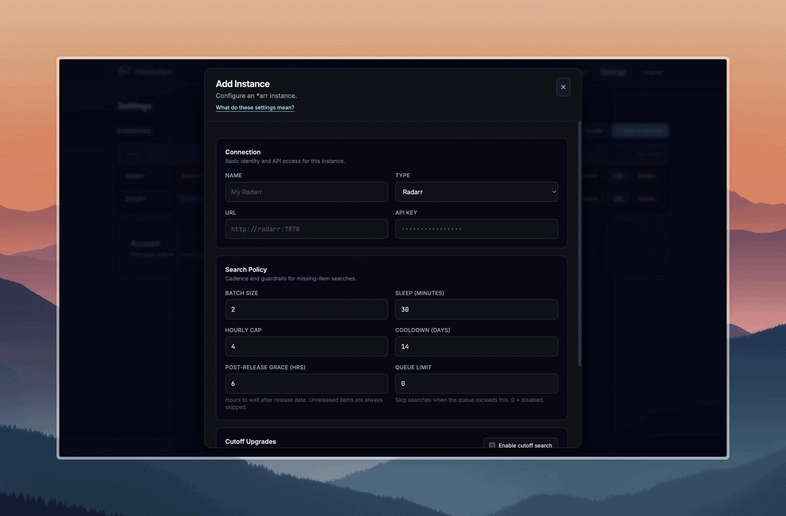
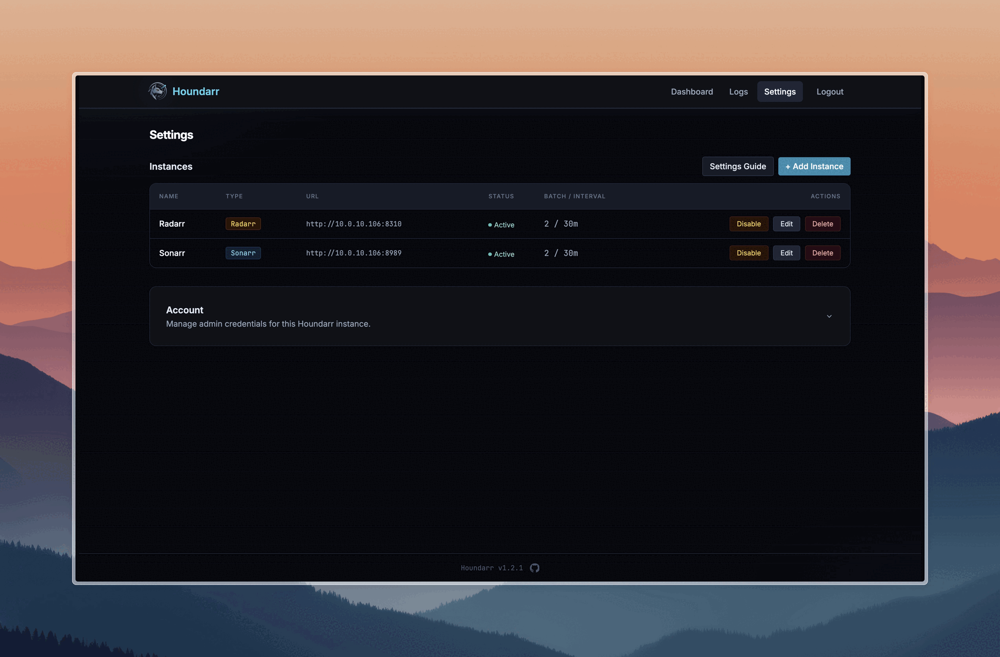

# Instance Settings

Per-instance configuration for the search engine. Each field is
documented with default, range where applicable, and behavior.

For the Search Order explanation (Random vs Chronological) see
[Search Order](/docs/concepts/search-order). For tuning guidance
see [Increase Throughput](/docs/guides/increase-throughput). For
the per-app API command Houndarr sends see
[Search Commands](/docs/reference/search-commands).

## Missing search controls

### Batch Size

Maximum number of missing items considered per cycle.

- Default: `2`
- Lower values are safer; higher values clear backlog faster.

### Sleep (minutes)

Wait time between cycles for each enabled instance.

- Default: `30`
- Lower values increase request frequency.

### Hourly Cap

Maximum successful missing searches per hour.

- Default: `4`
- Set `0` to disable this cap (not recommended unless you trust
  upstream limits).

### Cooldown (days)

Minimum days before retrying the same missing item.

- Default: `14`
- Larger values reduce repeat search noise.
- Release-aware retry applies to the missing pass only. See
  [Skip Reasons](/docs/reference/skip-reasons#release-aware-retry).

### Post-Release Grace (hours)

Hours to wait after an item's release date before searching.

- Default: `6`
- Items inside this window log as `post-release grace (Nh)` and
  skip.
- Items not yet released (no date, or a future date) log as
  `not yet released` regardless of this setting.

Release date evaluation varies by app type:

| App | Date priority chain |
|-----|---------------------|
| Radarr | `digitalRelease` -> `physicalRelease` -> `releaseDate` -> `inCinemas`. Unavailable or pre-release titles may be skipped via `isAvailable` / `status`. |
| Sonarr, Whisparr v2 | `airDateUtc` (Sonarr) or `releaseDate` (Whisparr v2) |
| Whisparr v3 | Same chain as Radarr: `digitalRelease` -> `physicalRelease` -> `inCinemas` |
| Lidarr | Album `releaseDate` |
| Readarr | Book `releaseDate` |

### Sonarr Missing Search Mode

Strategy for Sonarr missing-pass commands.

- Default: `Episode search (default)`
- Advanced: `Season-context search (advanced)`

Season-context mode sends at most one `SeasonSearch` per
`(series, season)` per pass. Cooldown in season-context mode is
tracked at the season level via a stable synthetic ID derived from
the series ID and season number, not through any individual
episode. Cooldown history stays consistent across cycles regardless
of which episode appears first on the wanted list.

### Lidarr Missing Search Mode

- Default: `Album search (default)`
- Advanced: `Artist-context search (advanced)`

Artist-context mode sends at most one `ArtistSearch` per artist per
pass.

### Readarr Missing Search Mode

- Default: `Book search (default)`
- Advanced: `Author-context search (advanced)`

Author-context mode sends at most one `AuthorSearch` per author per
pass.

### Whisparr v2 Missing Search Mode

- Default: `Episode search (default)`
- Advanced: `Season-context search (advanced)`

Whisparr v3 has no search mode selection; it always searches at the
movie level.

## Search Order

See [Search Order](/docs/concepts/search-order) for the full
explanation.

- Default: `Random` (fresh installs only; existing instances keep
  their pre-upgrade setting, typically `Chronological`)
- Alternative: `Chronological`

## Cutoff upgrade controls

### Cutoff search

Enable searching for items that do not meet your quality cutoff.

- Default: Off

### Cutoff Batch

Maximum cutoff items considered per cutoff cycle.

- Default: `1`

### Cutoff Cooldown

Minimum days before retrying the same cutoff item.

- Default: `21`

### Cutoff Cap

Maximum successful cutoff searches per hour.

- Default: `1`
- Set `0` to disable the cutoff hourly cap.

Cutoff searches use separate cap and cooldown from missing
searches, so the two passes do not draw from the same budget. The
missing-pass release-aware retry does not apply to cutoff searches.

## Library upgrade controls

### Upgrade search

Re-search items that already have files and meet your quality
cutoff. Lets your *arr instance find better releases based on
quality profiles and custom format scoring.

- Default: Off
- Unlike cutoff search (which targets items *below* cutoff),
  upgrade search targets items that *already meet* cutoff.

### Upgrade Batch

- Default: `1`
- Hard cap: `5`. Engine-enforced; configured values above 5 are
  clamped to 5.

### Upgrade Cooldown (days)

- Default: `90`
- Minimum: `7`. Engine-enforced; configured values below 7 are
  clamped to 7.

### Upgrade Cap

- Default: `1`
- Hard cap: `5`. Engine-enforced.
- Set `0` to disable the upgrade hourly cap.

### Upgrade Search Mode

Per-app strategy for upgrade-pass commands. Independent of the
missing search mode.

- Sonarr, Whisparr v2: Episode (default) or Season-context
- Lidarr: Album (default) or Artist-context
- Readarr: Book (default) or Author-context
- Radarr, Whisparr v3: Always movie-level (no mode selection)

### Offset-based rotation

Applies when `Search Order` is `Chronological`. Persistent per-pass
offsets (`missing_page_offset`, `cutoff_page_offset`, and upgrade
offsets) advance through the wanted list across cycles so items
further down do not starve. Offsets reset to page 1 when you save
instance settings. Upgrade offsets reset to zero when upgrade
search is toggled off.

Under `Search Order: Random`, the offset columns are still written
but not used for rotation; the engine picks a fresh random page
each cycle.

## Queue backpressure

- Default: `0` (disabled)
- When set above zero, the cycle is skipped with reason
  `queue backpressure (N/M)` if the download queue count is at or
  above the limit.
- Fail-open: unreachable queue endpoint lets the cycle proceed.
- See
  [Skip Reasons: queue backpressure](/docs/reference/skip-reasons#queue-backpressure).

## Allowed search window

Restricts scheduled cycles to one or more time-of-day windows.

- Default: empty (24/7)
- Format: `HH:MM-HH:MM` per window, comma-separated for multiple.
  Examples: `09:00-23:00`, `09:00-12:00,18:00-22:00`,
  `22:00-06:00` (wrap-around).
- Timezone: windows interpreted in the container's local time (`TZ`
  env var; falls back to UTC).
- Boundary: start inclusive, end exclusive. `09:00-12:00` allows
  09:00:00 but blocks 12:00:00.
- DST caveat: avoid windows overlapping the spring-forward gap
  (02:00-03:00 does not exist that day) or the fall-back repeat
  (01:00-02:00 occurs twice).
- Manual `Run Now` always runs, even outside the window. The gate
  applies to scheduled cycles only.
- When the gate fires, the cycle logs one `outside allowed time
  window` info row and sleeps normally. See
  [Skip Reasons: outside allowed time window](/docs/reference/skip-reasons#outside-allowed-time-window).

## Recommended starting profile

| Setting | Value |
|---------|-------|
| Batch Size | `2` |
| Sleep (minutes) | `30` |
| Hourly Cap | `4` |
| Cooldown (days) | `14` |
| Post-Release Grace (hrs) | `6` |
| Queue Limit | `0` (disabled) |
| Allowed Search Window | (blank, 24/7) |
| Search Order | `Random` |
| Cutoff search | Off |
| Cutoff Batch | `1` |
| Cutoff Cooldown | `21` |
| Cutoff Cap | `1` |
| Upgrade search | Off |
| Upgrade Batch | `1` (hard cap: 5) |
| Upgrade Cooldown | `90` (min: 7) |
| Upgrade Cap | `1` (hard cap: 5) |

## Status control

Instance enabled / disabled state is controlled from the row toggle
in Settings. New instances are created as enabled by default.

